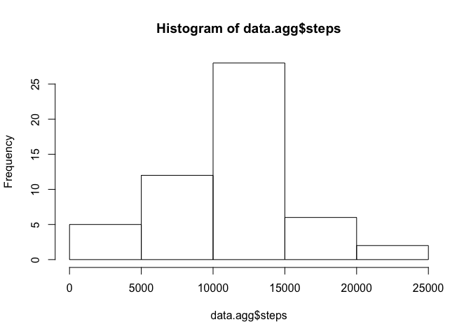
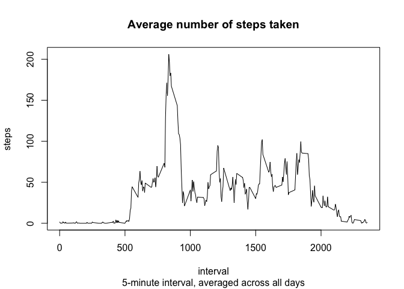
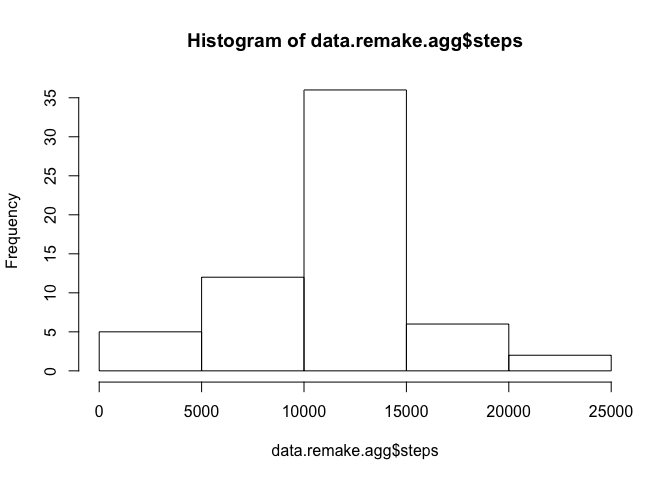
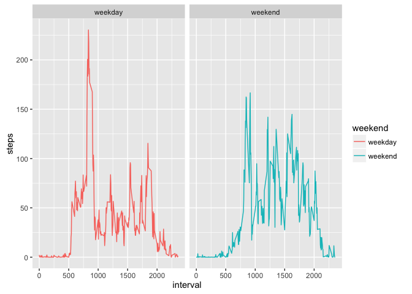

# Reproducible Research: Peer Assessment 1


## Loading and preprocessing the data


```r
  library(knitr)
  opts_knit$set(root.dir=normalizePath('./'))
  opts_chunk$set(fig.path = "./figures/", dev='png') # corrected path and added dev
```


```r
data <- read.csv("activity.csv", header=T)
data$date <- as.Date(data$date, "%Y-%m-%d")
```

## Make a histogram of the total number of steps taken each day


```r
data.agg <- aggregate(steps ~ date, data, sum)
hist(data.agg$steps)
```

<!-- -->

## What is mean total number of steps taken per day?


```r
# Calculate and report the mean and median total number of steps taken per day
mean(data.agg$steps)
```

```
## [1] 10766.19
```

```r
median(data.agg$steps)
```

```
## [1] 10765
```

## What is the average daily activity pattern?


```r
# Make a time series plot (i.e. type = "l") of the 5-minute interval (x-axis) 
# and the average number of steps taken, averaged across all days (y-axis)
data.5min <- aggregate(steps ~ interval, data, mean, na.action = na.omit)
plot(steps ~ interval, data.5min, type="l", main="Average number of steps taken", sub="5-minute interval, averaged across all days")
```

<!-- -->

Which 5-minute interval, on average across all the days in the dataset, contains the maximum number of steps?


```r
# Which 5-minute interval, on average across all the days in the dataset, contains the maximum number of steps?
data.5min[data.5min$steps == max(data.5min$steps),]
```

```
##     interval    steps
## 104      835 206.1698
```

## Imputing missing values

Calculate the total number of missing values in the dataset (i.e. the total number of rows with NAs).


```r
# Calculate and report the total number of missing values in the dataset (i.e. the total number of rows with NAs)
sum(!complete.cases(data))
```

```
## [1] 2304
```

```r
# Confirm by number of NA's in summary output
summary(data)
```

```
##      steps             date               interval     
##  Min.   :  0.00   Min.   :2012-10-01   Min.   :   0.0  
##  1st Qu.:  0.00   1st Qu.:2012-10-16   1st Qu.: 588.8  
##  Median :  0.00   Median :2012-10-31   Median :1177.5  
##  Mean   : 37.38   Mean   :2012-10-31   Mean   :1177.5  
##  3rd Qu.: 12.00   3rd Qu.:2012-11-15   3rd Qu.:1766.2  
##  Max.   :806.00   Max.   :2012-11-30   Max.   :2355.0  
##  NA's   :2304
```

Filling in all of the missing values in the dataset.
Using the mean for that 5-minute interval.


```r
missing <- data[!complete.cases(data),]
merge.missing <- merge(missing, data.5min, by="interval",all.x=T)
colnames(merge.missing) <- c("interval", "tmp", "date", "steps")
data.remake <- rbind(data[complete.cases(data),c("steps", "date", "interval")], merge.missing[,c("steps", "date", "interval")])
```

A histogram of the total number of steps taken each day. 


```r
data.remake.agg <- aggregate(steps ~ date, data.remake, sum)
hist(data.remake.agg$steps)
```

<!-- -->

Calculate the mean and median total number of steps taken per day.

```r
# Calculate and report the mean and median total number of steps taken per day
mean(data.remake.agg$steps)
```

```
## [1] 10766.19
```

```r
median(data.remake.agg$steps)
```

```
## [1] 10766.19
```

Do these values differ from the estimates from the first part of the assignment?

```r
if (mean(data.remake.agg$steps) != mean(data.agg$steps)) {
  message("mean of remodelled data is different")
} else {
  message("mean of remodelled data is not different")
}
```

```
## mean of remodelled data is not different
```

```r
if (median(data.remake.agg$steps) != median(data.agg$steps)) {
  message("median of remodelled data is different")
} else {
  message("median of remodelled data is not different")
}
```

```
## median of remodelled data is different
```

What is the impact of imputing missing data on the estimates of the total daily number of steps?

```r
sum(data.remake.agg$steps, na.rm = T) - sum(data.agg$steps, na.rm = T)
```

```
## [1] 86129.51
```


## Are there differences in activity patterns between weekdays and weekends?


```r
data.remake$weekend <- ifelse(weekdays(data.remake$date) %in% c("Saturday", "Sunday"), "weekend", "weekday")

require(ggplot2)
```

```
## Loading required package: ggplot2
```

```r
data.weekend <- aggregate(steps ~ interval + weekend, data.remake, mean, na.action = na.omit)

ggplot(data=data.weekend, aes(x=interval, y=steps, color=weekend), main="Average number of steps taken") + facet_wrap(~weekend) + geom_line()
```

<!-- -->
